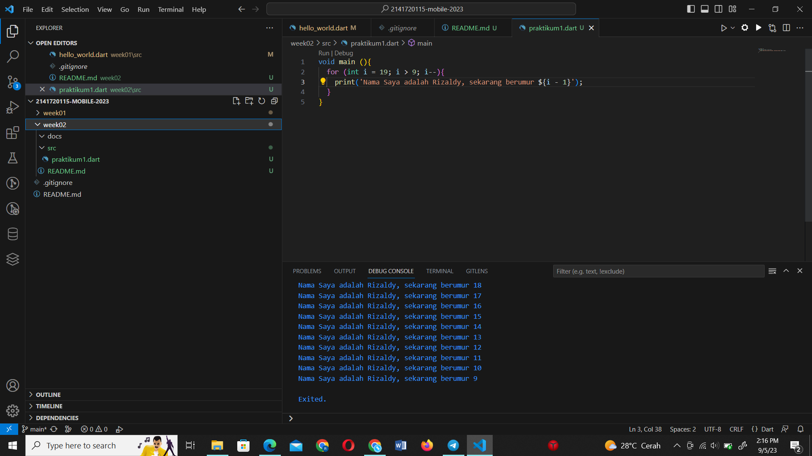

## Rizaldy Ali Machfuddin
## 2141720115

### Pengantar Bahasa Pemrograman Dart

#### Soal 1

#### Soal 2

Mengapa sangat penting untuk memahami bahasa pemrograman Dart sebelum kita menggunakan framework Flutter ? Jelaskan!

Jawab : 
- Memahami Dart adalah dasar untuk bekerja dengan Flutter; pengembang perlu mengetahui asal-usul bahasa Dart, bagaimana komunitas mengerjakannya, kelebihannya, dan mengapa itu adalah bahasa pemrograman yang dipilih untuk Flutter. Dengan memahami bahasa Dart, kita akan merasa nyaman untuk bereksperimen dengan Dart dan bisa berkreasi lebih menggunakan flutter.

#### Soal 3

Rangkumlah materi dari codelab ini menjadi poin-poin penting yang dapat Anda gunakan untuk membantu proses pengembangan aplikasi mobile menggunakan framework Flutter.

Jawab : 
 - Mengetahui kelebihan serta fitur fitur dari bahasa pemrograman dart
 - Evolusi atau perkembangan dart dari tahun ke tahun
 - Mengidentifikasi bagaimana sistem dari bahasa pemrograman dart bekerja
 - Memahami struktur dari bahasa pemrograman dart
 - Mengetahui operator operator yang bis digunakan
 - Mencoba coding dengan bahasa dart

 #### Soal 4
 https://www.canva.com/design/DAFtkHvdCGg/hFeeBB4ea6LjBSNHJFJzcw/edit
