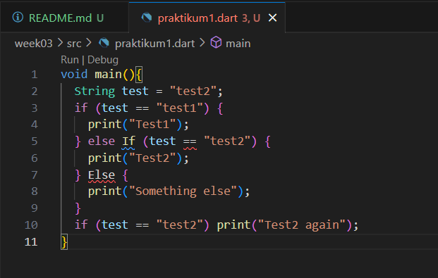
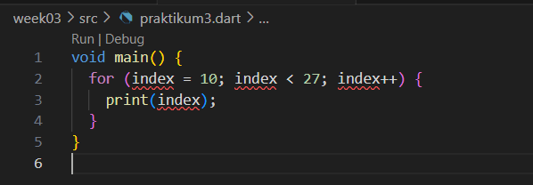
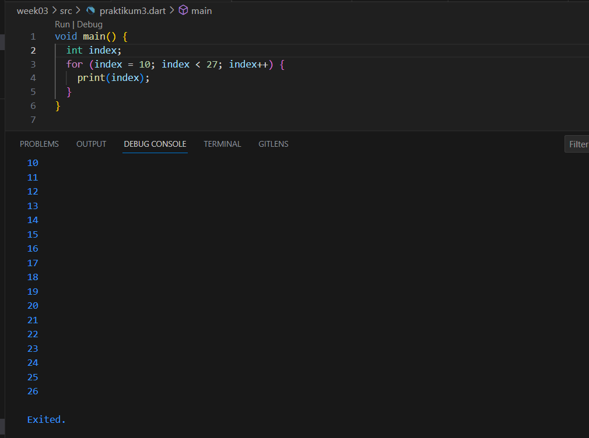
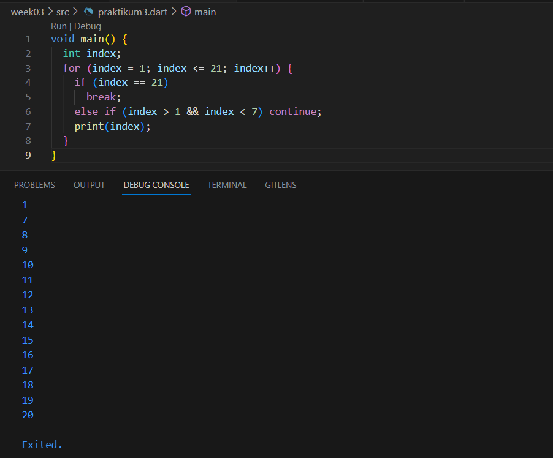
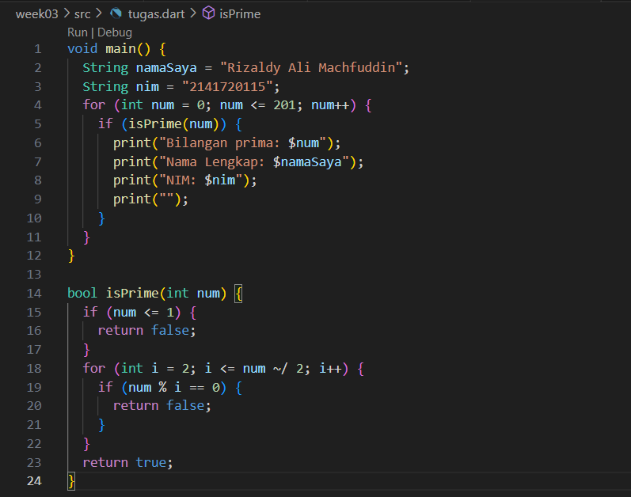
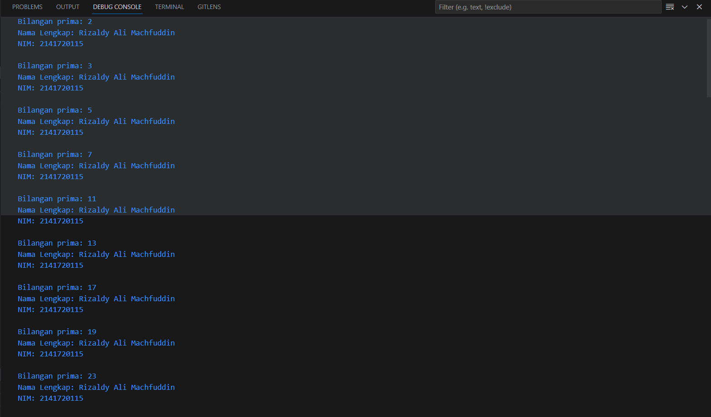
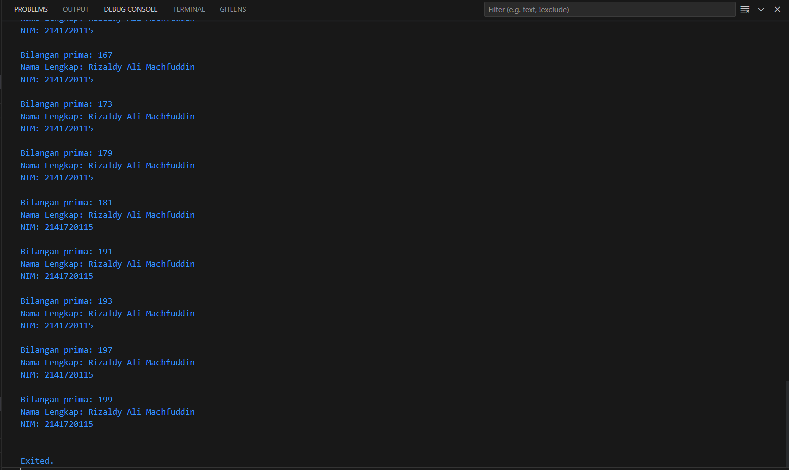

## Rizaldy Ali Machfuddin
## 2141720115

### Pengantar Bahasa Pemrograman Dart Bagian 3

#### Langkah 1
Ketik atau salin kode program berikut ke dalam fungsi main().

#### Langkah 2
Silakan coba eksekusi (Run) kode pada langkah 1 tersebut. Apa yang terjadi? Jelaskan!

- Menampilkan output Test2 dan Test2 again karena kode pertama yang menginisialisasi variabel String test dengan nilai "test2". Selanjutnya kode memeriksa apakah test sama dengan "test2" dengan menggunakan pernyatan if yang lain. Karena "test" sama dengan "test2", maka kode mencetak "Test2 again" ke terminal
#### Langkah 3
Tambahkan kode program berikut, lalu coba eksekusi (Run) kode Anda. 

Apa yang terjadi ? Jika terjadi error, silakan perbaiki namun tetap menggunakan if/else. 
- Untuk kode yang sudah diberikan mengalami eror karena dalam pernyataan "if" harus merupakan nilai boolean. Sedangkan di kode tersebut merupakan String "true" sebagai kondisi. Maka perbaikannya seperti kode dibawah ini dengan mengubah menjadi ekspresi boolean

### Praktikum 2: Menerapkan Perulangan "WHILE" dan "DO-WHILE"
#### Langkah 1
Ketik atau salin kode program berikut ke dalam fungsi main().

#### Langkah 2
Silakan coba eksekusi (Run) kode pada langkah 1 tersebut. Apa yang terjadi? Jelaskan! Lalu perbaiki jika terjadi error.

- Jika kita mengeksekusi kode pada langkah satu, maka terjadi eror karena variable counter yang belum diberi nilai pada sebelumnya. Maka perbaikan pada kode yang eror seperti gambar dibawah ini

#### Langkah 3
Tambahkan kode program berikut, lalu coba eksekusi (Run) kode Anda.

- Saat mengeksekusi program diatas, maka menghasilkan output seperti gambar dibawah ini

### Praktikum 3: Menerapkan Perulangan "FOR" dan "BREAK-CONTINUE"
#### Langkah 1
Ketik atau salin kode program berikut ke dalam fungsi main().

#### Langkah 2
Silakan coba eksekusi (Run) kode pada langkah 1 tersebut. Apa yang terjadi? Jelaskan! Lalu perbaiki jika terjadi error.

- Saat mengeksekusi program diatas menghasilkan output eror karena kurang mendeklarasikan tipe data variabel index, maka dari itu perlunya mendeklarasikan variabel index dengan tipe datanya terlebih dahulu sebelum menggunakannya dalam loop. Perbaikan kode eror tersebut bisa dilihat pada gambar dibawah ini

#### Langkah 3
Tambahkan kode program berikut di dalam for-loop, lalu coba eksekusi (Run) kode Anda.

Apa yang terjadi ? Jika terjadi error, silakan perbaiki namun tetap menggunakan for dan break-continue.
- Saat menjalankan kode program diatas, mengalami eror pernyataan if, else if, dan else harus ditulis dengan huruf kecil. Lalu tidak terdefinisikan variabel index dan mengharuskan mengisi index dengan nilai 1. Dan menambahkan perulangan for. Untuk perbaikan kode yang eror bisa dilihat pada kode dibawah ini

### TUGAS
#### Buatlah sebuah program yang dapat menampilkan bilangan prima dari angka 0 sampai 201 menggunakan Dart. Ketika bilangan prima ditemukan, maka tampilkan nama lengkap dan NIM Anda.
- Kode

- Output

- Penjelasan
1. Dimulai dengan mendeklarasikan dua variabel String "namaSaya" dan "nim" yang berfungsi menampilkan nama langkap dan nim
2. Lalu ada loop for yang berguna mencari bilangan prima dan akan mengulang dari 0 - 201. Dalam loop for juga ada pemanggilan fungsi 'isPrime(num)' yang berguna untuk memeriksa apakah 'num' adalah bilangan prima atau tidak
3. Fungsi 'isPrime(num) adalah fungsi untuk memeriksa apakah suatu angka 'num' adalah bilangan prima atau tidak. Fungsi ini akan mengembalikan 'true' jika 'num' adalah bilangan prima
4. Dalam fungsi 'isPrime()' juga ada pemeriksaan dimana jika 'num' kurang dari 1 maka akan dikembalikan kedalam false. Lalu memeriksa apakah num bisa dibagi habis oleh angka lainn 'num ~/ 2', Jika i adalah faktor dari num(artinya, num % i adalah 0), maka num bukanlah bilangan prima dan fungsi mengembalikan false. Jika semua pengujian tidak menghasilkan pembagian habis, maka num dianggap sebagai bilangan prima, dan fungsi mengembalikan true.
5. Jika fungsi isPrime(num) mengembalikan true, program mencetak bilangan prima, nama lengkap, dan nim. 
6. Program ini berlanjut hingga semua angka dari 0-201 diperiksa