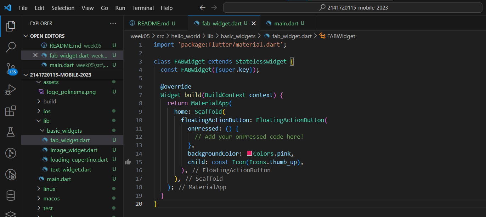

# Pemrograman Mobile - Pertemuan #5

NIM : 2141720115

Nama : Rizaldy Ali Machfuddin

#

## Praktikum 1: Membuat Project Flutter Baru

#

#### Langkah 1: Buat Project Aplikasi Flutter Baru

#### Langkah 2: Pilih Lokasi

#### Langkah 3: Beri Nama Project

#### Langkah 4

#

## Praktikum 2 : Membuat Repository Github dan Laporan Praktikum
(Langkah 1 - 10 saya lewati karena saya sudah memiliki repository github)

A new Flutter project 

## Praktikum 3 : Menerapkan Widget Dasar
#### Langkah 1: Text Widget

- Import text_widgets.dart di main.dart

- Output

#### Langkah 2: Image Widget

- Import image_widget.dart di main.dart

- Output

- Menyesuikan ukuran image pada image_widget.dart

- Output

## Praktikum 4 : Menerapkan Widget Material Design dan iOS Cupertino

#### Langkah 1: Cupertino Button dan Loading Bar

- 

- Pada main.dart

- Output

- Saya coba menjalankan class ButtonCupertinoWidget langsung dalam function main file main.dart

- Output

#### Langkah 2: Floating Action Button (FAB)

- Output

#### Langkah 3: Scaffold Widget

- main

- Output

#### Langkah 4: Dialog Widget

- main

- Output

#### Langkah 5: Input dan Selection Widget

- main

- Output

#### Langkah 6: Date and Time Pickers

- Output

#

