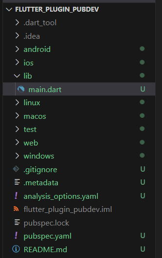
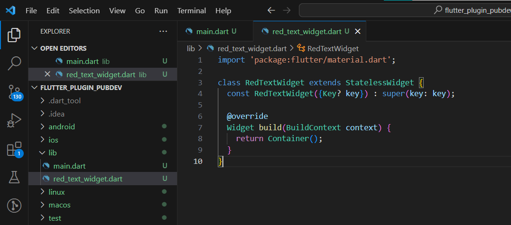
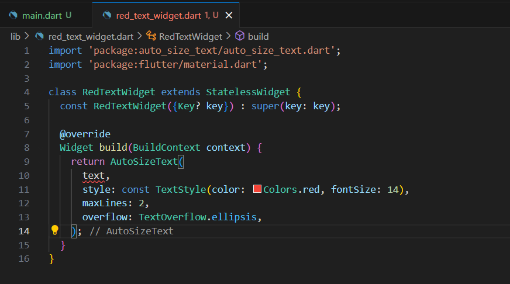
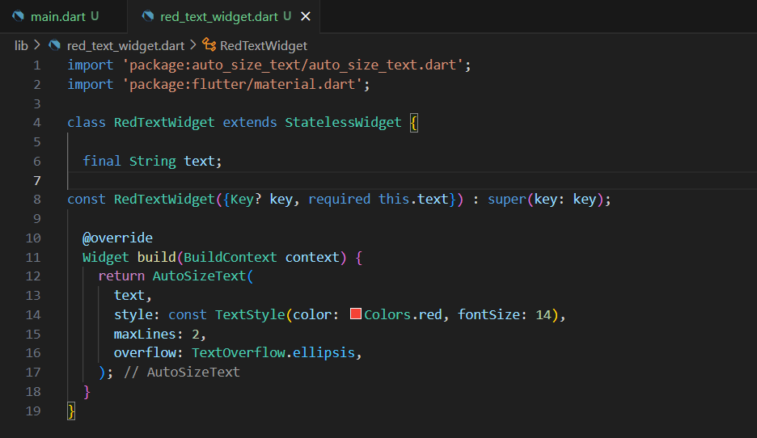
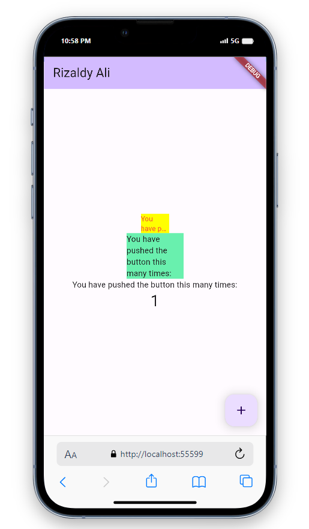

## Nama : Rizaldy Ali Machfuddin
## NIM : 2141720115
## Kelas : TI - 3F

 
 

# Praktikum Menerapkan Plugin di Project Flutter

### Langkah 1: Buat Project Baru

### Langkah 2: Menambahkan Plugin

### Langkah 3: Buat file red_text_widget.dart

### Langkah 4: Tambah Widget AutoSizeText

>Terjadi error karena belum menambahkan Variabel text dan parameter di constructor.

### Langkah 5: Buat Variabel text dan parameter di constructor

### Langkah 6: Tambahkan widget di main.dart

### Hasil Running

# Tugas Praktikum

1. Selesaikan Praktikum tersebut, lalu dokumentasikan dan push ke repository Anda berupa screenshot hasil pekerjaan beserta penjelasannya di file README.md!
> Selesai
2. Jelaskan maksud dari langkah 2 pada praktikum tersebut!
> Kode terminal pada langkah 2 tersebut digunakan untuk menambahkan paket *auto_size_text* ke proyek Flutter Anda. Paket ini memungkinkan kita menggunakan widget *AutoSizeText* yang secara otomatis menyesuaikan ukuran teks untuk sesuai dengan batasnya.
3. Jelaskan maksud dari langkah 5 pada praktikum tersebut!
> Pada langkah 5, ditambahkan varibel text dan parameter di constructor, maksud dari langkah ini menampilkan teks berwarna merah dan memiliki kemampuan untuk diberi kunci unik untuk pengidentifikasian yang efisien. Teks yang akan ditampilkan oleh widget ini disimpan dalam variabel text.
4. Pada langkah 6 terdapat dua widget yang ditambahkan, jelaskan fungsi dan perbedaannya!
> Terdapat 2 Widget pada Langkah 6, pada widget yang pertama menggunakan RedTextWidget, digunakan untuk menampilkan teks dengan warna merah. Sedangkan pada widget yang kedua, teks ditampilkan dengan menggunakan widget bawaan Text. Ini adalah widget Flutter standar yang digunakan untuk menampilkan teks dengan gaya default. RedTextWidget memiliki tampilan khusus yang disesuaikan, sementara Text hanya menampilkan teks dengan gaya default.
5. Jelaskan maksud dari tiap parameter yang ada di dalam plugin auto_size_text berdasarkan tautan pada dokumentasi ini !

|Parameter          |Penjelasan                
|-------------------|-------------------------------
|Key                |Digunakan untuk mengidentifikasi widget secara unik dalam widget tree. Ini berguna untuk mengontrol animasi, navigasi, fokus, dan lainnya
|textKey            |Digunakan untuk mengidentifikasi widget Text yang dibungkus oleh widget AutoSizeText. Ini berguna untuk mengakses properti atau metode dari widget Text
|style              |Digunakan untuk menentukan gaya teks seperti warna, ukuran, font, dll. Ini sama dengan parameter style pada widget Text
|minFontSize        |Digunakan untuk menentukan ukuran font terkecil yang diizinkan. Jika teks masih tidak muat, maka akan ditangani sesuai dengan parameter overflow.
|maxFontSize        |Digunakan untuk menentukan ukuran font terbesar yang diizinkan. Ini berguna jika gaya teks mewarisi ukuran font dan Anda ingin membatasinya.
|stepGranularity    |Digunakan untuk menentukan langkah penyesuaian ukuran font. Nilai ini menentukan seberapa halus perubahan ukuran font.
|presetFontSizes    |Digunakan untuk menentukan daftar ukuran font yang diizinkan. Jika parameter ini ditentukan, maka parameter minFontSize, maxFontSize, dan stepGranularity akan diabaikan. Widget AutoSizeText akan mencoba ukuran font dari daftar ini secara berurutan sampai teks muat dalam batasnya.
|group              |Digunakan untuk menyinkronkan ukuran font dari beberapa widget AutoSizeText. Mereka akan menyesuaikan batas mereka dan semua widget AutoSizeText dalam grup yang sama akan memiliki ukuran yang sama.
|textAlign*         |Digunakan untuk menentukan cara menyelaraskan teks secara horizontal. Ini sama dengan parameter textAlign pada widget Text
|textDirection*     |Digunakan untuk menentukan arah teks, yaitu kiri ke kanan atau kanan ke kiri.
|locale*            |Digunakan untuk menentukan lokal teks, yaitu bahasa dan wilayah tertentu. Ini sama dengan parameter locale pada widget Text.
|softWrap*          |Digunakan untuk menentukan apakah teks harus dibungkus ke baris baru jika melebihi lebar batasnya. 
|wrapWords          |Digunakan untuk menentukan apakah teks harus dibungkus per kata atau per karakter jika melebihi lebar batasnya.
|overflow*          |Digunakan untuk menentukan cara menangani teks jika melebihi tinggi batasnya.
|overflowReplacement|Digunakan untuk menentukan widget pengganti jika teks tidak muat dalam batasnya bahkan setelah mencapai ukuran font terkecil atau menggunakan daftar ukuran font preset.
|textScaleFactor*   |Digunakan untuk menentukan faktor skala teks, yaitu pengali untuk ukuran font.
|maxLines           |Digunakan untuk menentukan jumlah baris maksimal untuk teks. Jika tidak ada parameter ini yang ditentukan, maka widget AutoSizeText hanya akan menyesuaikan teks sesuai dengan lebar dan tinggi yang tersedia.
|semanticsLabel*    |Digunakan untuk menentukan label semantik untuk teks, yaitu deskripsi yang dapat dibaca oleh teknologi aksesibilitas seperti pembaca layar.