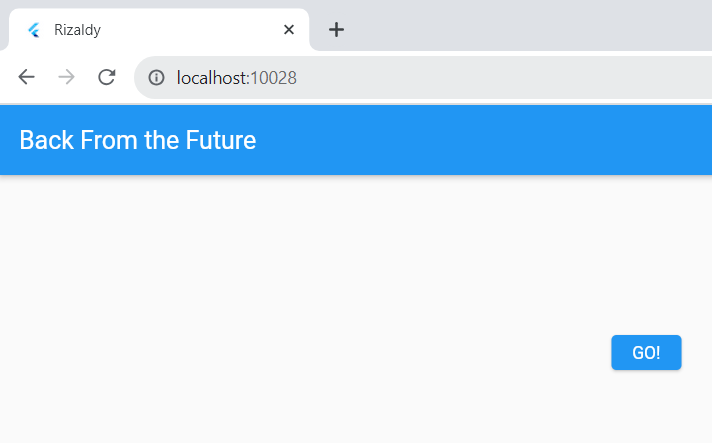
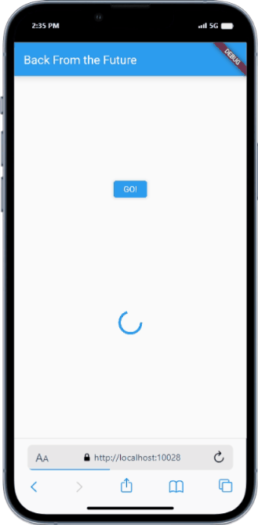
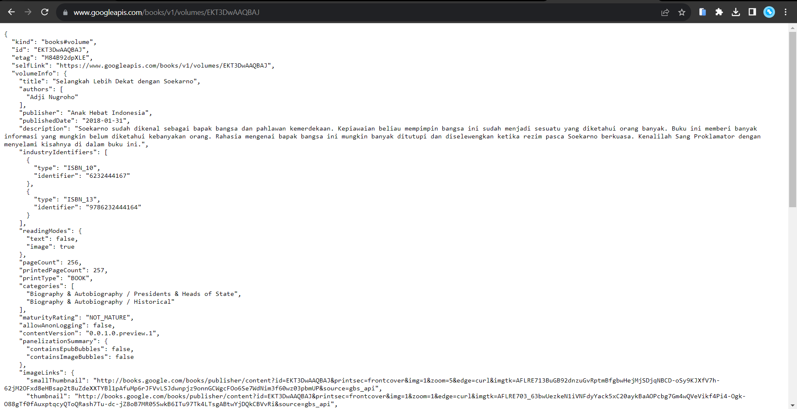
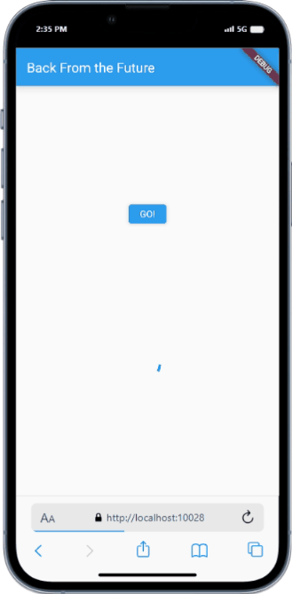

# Pemrograman Mobile - Pertemuan 12

NIM : 2141720115

Nama : Rizaldy Ali Machfuddin

 

## Praktikum 1

#### Soal 1

 

#### Soal 2

 

#### Soal 3

 
Penjelasan :
substring digunakan untuk mendapatkan string dengan mengambil 450 karakter pertama, sedangkan catchError adalah metode yang dipanggil jika terjadi kesalahan saat menjalankan future.
