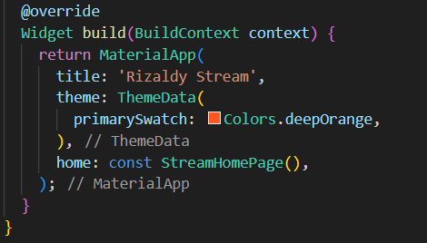

# Pertemuan Minggu 13 - Lanjutan State dengan Streams
## Praktikum 1 - Dart Streams
### Soal 1
- Tambahkan nama panggilan Anda pada title app sebagai identitas hasil pekerjaan Anda. 
 
- Gantilah warna tema aplikasi sesuai kesukaan Anda. 
 
- Lakukan commit hasil jawaban Soal 1 dengan pesan "W13: Jawaban Soal 1" 
### Soal 2
- Tambahkan 5 warna lainnya sesuai keinginan Anda pada variabel colors tersebut. 
 
- Lakukan commit hasil jawaban Soal 2 dengan pesan "W13: Jawaban Soal 2"
### Soal 3 
- Jelaskan fungsi keyword yield* pada kode tersebut!  
fungsi yields* adalah untuk mengirimkan nilai-nilai dari stream yang dihasilkan oleh ekspresi di sebelah kanan. Dengan kata lain, setiap fungsi ini dipanggil, akan mengirimkan warna dari stream yang dihasilkan oleh **Stream.periodic** 
- Apa maksud isi perintah kode tersebut?  
Penjelasan mengenai kode adalah  kode tersebut membuat sebuah stream yang menghasilkan warna dari daftar warna setiap detik. yield* digunakan untuk mengirimkan nilai-nilai dari stream yang dihasilkan oleh **Stream.periodic.** Tujuan akhirnya adalah menghasilkan suatu stream yang terus-menerus mengeluarkan warna-warna yang ada dalam daftar colors. 
- Lakukan commit hasil jawaban Soal 3 dengan pesan "W13: Jawaban Soal 3" 
### Soal 4
- Capture hasil praktikum Anda berupa GIF dan lampirkan di README.  

- Lakukan commit hasil jawaban Soal 4 dengan pesan "W13: Jawaban Soal 4" 
### Soal 5
- Jelaskan perbedaan menggunakan listen dan await for (langkah 9) !  
1. *await forcdigunakan dalam fungsi yang diawasi oleh async. Hal ini memungkinkan pengguna untuk melakukan iterasi secara langsung melalui setiap elemen baru sebelum melanjutkan ke elemen berikutnya. Cocok digunakan dalam blok fungsi yang sifatnya async dan digunakan dalam fungsi yang dijelaskan dengan async 
2. *listen* digunakan untuk diluar konteks fungsi yang dijelaskan dengan async. Metode listen adalah metode pada objek stream yang memungkinkan untuk mendaftarkan fungsi callback yang akan dipanggil setiap kali ada data yang tersedia di dalam stream.  
Jadi, jika ingin melakukan iterasi secara langsung dan menggunakan await di dalam fungsi yang diawasi, gunakan *await for. Jika Anda hanya perlu mendengarkan perubahan stream dan menjalankan fungsi callback ketika ada data baru, Anda dapat menggunakan **listen*. 
- Lakukan commit hasil jawaban Soal 5 dengan pesan "W13: Jawaban Soal 5" 
## Praktikum 2 - Stream Controllers dan Sinks
### Soal 6
- Jelaskan maksud kode langkah 8 dan 10 tersebut! 
1. Langkah 8 adalah ketika menginisialisasi objek NumberStream, mengambil controller stream, dan mendengarkan perubahan pada stream angka. Setiap kali ada perubahan, nilai terakhir (lastNumber) dalam state diperbarui menggunakan setState().  
2. Langkah 10 adalah fungsi addRandomNumber membuat objek Random untuk menghasilkan angka acak antara 0 dan 9. Nilai acak tersebut kemudian ditambahkan ke dalam stream menggunakan metode addNumberToSink pada objek numberStream. 
- Capture hasil praktikum Anda berupa GIF dan lampirkan di README. 
 
- Lalu lakukan commit dengan pesan "W13: Jawaban Soal 6".
### Soal 7
- Jelaskan maksud kode langkah 13 sampai 15 tersebut!  
Kode langkah 13-15 akan membuat handling ketika terjadi sebuah error menggunakan methode addError() pada class stream.dart. Jika terjadi error atau kesalahan selama proses iterasi, maka nilai dari lastNumber diatur menjadi -1  
 
- Kembalikan kode seperti semula pada Langkah 15, comment addError() agar Anda dapat melanjutkan ke praktikum 3 berikutnya. 
- Lalu lakukan commit dengan pesan "W13: Jawaban Soal 7". 
## Praktikum 3 - Injeksi Data ke Streams
### Soal 8
- Jelaskan maksud kode langkah 1-3 tersebut! 
Kode langkah 1-3 mendeklarasikan dan menginisialisasi objek StreamTransformer <int, int> dengan nama transformer. Transformer ini mengubah setiap data dalam stream angka dengan mengalikannya dengan 10, menangani kesalahan dengan mengirimkan nilai -1, dan menutup sink saat stream selesai. Selanjutnya, kode menggunakan transformer tersebut untuk mengubah data dalam stream dari objek numberStreamController, dan hasilnya diobservasi. Setiap kali ada perubahan, nilai terakhir (lastNumber) dalam state diperbarui, dan jika terjadi kesalahan, nilai -1 akan di-set ke dalam state. 
- Capture hasil praktikum Anda berupa GIF dan lampirkan di README. 
 
- Lalu lakukan commit dengan pesan "W13: Jawaban Soal 8". 
## Praktikum 4 - Subscribe ke Stream Events
### Soal 9
- Jelaskan maksud kode langkah 2, 6 dan 8 tersebut! 
1. Kode langkah 2 untuk melakukan langganan pada stream agar mendapatkan informasi ataupun output dari stream 
2. Kode langkah 6 untuk pembatalan subscribe pada stream. Jadi ketika screen tidak ditampilkan, metode ini akan dipanggil. Hal ini berguna untuk membersihkan sumber daya dan menghemat penyimpanan 
3. Kode langkah 8 adalah fungsi addRandomNumber membuat objek Random untuk menghasilkan angka acak antara 0 dan 9. Selanjutnya, fungsi tersebut memeriksa apakah numberStreamController sudah ditutup (closed). Jika belum ditutup, nilai acak tersebut ditambahkan ke dalam stream menggunakan metode addNumberToSink pada objek numberStream. Jika numberStreamController sudah ditutup, maka nilai -1 akan di-set ke dalam state lastNumber. Ini bertujuan untuk menghindari penambahan data ke dalam stream yang sudah ditutup. 
- Capture hasil praktikum Anda berupa GIF dan lampirkan di README. 
 
- Lalu lakukan commit dengan pesan "W13: Jawaban Soal 9". 
